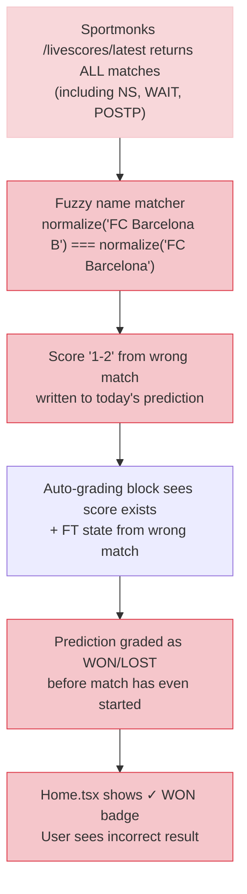

# Vantage AI — Premature Grading Bug: Deep Audit & Implementation Plan
> **Date**: April 26, 2026 | **Severity**: 🔴 Critical | **Target**: Minimax 2.5

---

## LANDING PAGE CHANGES — CONFIRMED ✅

| Change | File | Line | Status |
|--------|------|------|--------|
| `max-w-md` → `max-w-md md:max-w-6xl` | `App.tsx` | 217 | ✅ Applied |
| Ambient glow `max-w-lg` → `max-w-4xl` | `App.tsx` | 212 | ✅ Applied |
| Auth forms wrapped in `max-w-md mx-auto` | `App.tsx` | 252 | ✅ Applied |
| Main content row widened with `lg:gap-24 lg:px-16` | `LandingPage.tsx` | 144 | ✅ Applied |

All 4 landing page fixes are correctly implemented. Desktop layout is now 1152px wide.

---

## BUG AUDIT: MATCHES SHOWING WON/LOST BEFORE THEY'VE PLAYED

### What the User Sees
Match cards on the Home page display scores like `0 - 0` or `1 - 2` with `✓ WON` or `✗ LOST` badges **even though the match hasn't kicked off yet**.

### Root Cause Analysis — 3 Compounding Bugs

---

### 🔴 ROOT CAUSE 1: Fuzzy Team Name Matching (scheduler.js:458-461)

The score auto-update matches predictions to live matches using a **3-way OR**:

```javascript
const liveMatch = matches.find(m => 
    String(m.id) === String(pred.fixture_id) ||          // ✅ Exact fixture ID
    String(m.homeTeamId) === String(pred.home_team_id) || // ⚠️  Team ID collision
    normalize(m.homeTeam) === normalize(pred.home_team)   // 🔴 Name collision!
);
```

**Problem**: The `normalize()` function strips ALL non-alphanumeric characters and lowercases. This creates collisions:

| Live Match (Different Day) | Prediction (Today) | Normalized |
|---|---|---|
| `FC Barcelona B` (live now in Copa) | `FC Barcelona` (today at 21:00) | `fcbarcelona` matches! |
| `Al Ahly SC` (live in Egyptian league) | `Al Ahly` (today in CAF CL) | `alahly` matches! |

When this happens, the live score from `FC Barcelona B`'s match (e.g., `1-2`) gets written into `FC Barcelona`'s prediction — even though Barcelona's match hasn't started.

> [!CAUTION]
> The same fuzzy matcher is used in BOTH the score writer (line 458) AND the auto-grading block (line 485). This means a match can be both **scored AND graded** incorrectly from a completely different fixture.

---

### 🔴 ROOT CAUSE 2: No Match State Filter on Score Updates (scheduler.js:446-468)

The score auto-update block writes scores for **ALL live matches regardless of state**:

```javascript
// Line 463: No state check — writes scores even for NS (Not Started) matches
if (liveMatch) {
    const newScore = `${liveMatch.homeScore} - ${liveMatch.awayScore}`;
    if (pred.score !== newScore) {
        pred.score = newScore;     // ← Writes "0 - 0" for NS matches!
        updated = true;
    }
}
```

The Sportmonks `/livescores/latest` API returns matches in ALL states including:
- `NS` (Not Started) — score is `0 - 0`
- `WAIT` — waiting for kickoff
- `LIVE` / `1H` / `HT` / `2H` — actually playing

A prediction gets matched to an `NS` match → score is set to `0 - 0` → the auto-grading block then checks if this match is `FT` (it's not, so it skips grading). **BUT the score `0 - 0` is already written to Firestore**, and the Home.tsx UI shows it with a badge.

---

### 🟡 ROOT CAUSE 3: UI Shows Score Without Kickoff Validation (Home.tsx:602-615)

```tsx
{match.score ? (
    <div className="flex flex-col items-center gap-0.5">
        <span className="...">{match.score.replace('-', ' - ')}</span>
        {match.status === 'won' && <span>✓ WON</span>}
        {match.status === 'lost' && <span>✗ LOST</span>}
        {match.status === 'pending' && match.score && <span>LIVE</span>}
    </div>
) : (
    <span>VS</span>
)}
```

The UI renders the score badge whenever `match.score` is truthy. There's **no check** for:
- Has the match actually kicked off? (compare `match.time` to current time)
- Is the score from the live feed or from grading?
- Is the match state valid (LIVE/FT) vs invalid (NS)?

---

## IMPLEMENTATION PLAN

### FIX-01: Use Strict Fixture ID Matching for Score Updates (P0)

**File**: `backend/scheduler.js`, lines 458-462

**Change**: Remove the fuzzy team name matcher from the score update block. Only match by `fixture_id` (the Sportmonks unique ID). This is the **only** reliable key.

```diff
 for (const pred of preds) {
-    const liveMatch = matches.find(m => 
-        String(m.id) === String(pred.fixture_id) ||
-        String(m.homeTeamId) === String(pred.home_team_id) ||
-        normalize(m.homeTeam) === normalize(pred.home_team)
-    );
+    // STRICT: Only match by fixture_id — team name matching causes cross-match contamination
+    const liveMatch = matches.find(m => 
+        String(m.id) === String(pred.fixture_id)
+    );
     if (liveMatch) {
```

**Why not keep team ID?**: `homeTeamId` can collide when the same team plays in two competitions on the same day (e.g., reserves/youth team).

---

### FIX-02: Only Write Scores for Active Match States (P0)

**File**: `backend/scheduler.js`, after line 462

Add a state filter so we only write scores for matches that are actually being played:

```diff
     if (liveMatch) {
+        // Only write scores for matches that are actually in play or finished
+        const activeStates = ['1H', '2H', 'HT', 'ET', 'PEN', 'FT', 'AET', 'LIVE', 'BREAK'];
+        const matchState = (liveMatch.stateShort || '').toUpperCase();
+        if (!activeStates.includes(matchState)) continue;  // Skip NS, WAIT, POSTP, etc.
+        
         const newScore = `${liveMatch.homeScore} - ${liveMatch.awayScore}`;
```

This prevents `NS` (Not Started) matches from having their `0 - 0` score written to the prediction.

---

### FIX-03: Apply Same Strict Matching to Auto-Grading Block (P0)

**File**: `backend/scheduler.js`, lines 485-489

The auto-grading block has the SAME fuzzy matcher. Fix it identically:

```diff
 for (const pred of preds) {
     if (pred.status && pred.status !== 'pending') continue;
     
-    const ftMatch = ftMatches.find(m =>
-        String(m.id) === String(pred.fixture_id) ||
-        String(m.homeTeamId) === String(pred.home_team_id) ||
-        normalize(m.homeTeam) === normalize(pred.home_team)
-    );
+    // STRICT: Only grade by fixture_id to prevent cross-match grading errors
+    const ftMatch = ftMatches.find(m =>
+        String(m.id) === String(pred.fixture_id)
+    );
```

---

### FIX-04: Add Live State Field to Prediction Updates (P1)

**File**: `backend/scheduler.js`, score update block

When writing scores, also write the match state so the UI can distinguish between LIVE, FT, and NS:

```diff
     if (liveMatch) {
         const activeStates = ['1H', '2H', 'HT', 'ET', 'PEN', 'FT', 'AET', 'LIVE', 'BREAK'];
         const matchState = (liveMatch.stateShort || '').toUpperCase();
         if (!activeStates.includes(matchState)) continue;
         
         const newScore = `${liveMatch.homeScore} - ${liveMatch.awayScore}`;
         if (pred.score !== newScore) {
             pred.score = newScore;
+            pred.live_state = matchState;
+            pred.live_minute = liveMatch.minute || 0;
             updated = true;
         }
     }
```

---

### FIX-05: UI — Only Show Score When Match Has Started (P1)

**File**: `pages/Home.tsx`, lines 601-616

Add a kickoff-time guard so the score badge only renders when the match has actually started:

```diff
 {/* VS + xG badge / Score Badge */}
 <div className="shrink-0 flex flex-col items-center">
-  {match.score ? (
+  {match.score && (match.status !== 'pending' || match.live_state) ? (
     <div className="flex flex-col items-center gap-0.5">
       <span className="text-[13px] font-black font-orbitron text-vantage-cyan px-2 tracking-widest bg-vantage-cyan/10 rounded border border-vantage-cyan/20">
         {match.score.replace('-', ' - ')}
       </span>
       {match.status === 'won' && (
         <span className="...">✓ WON</span>
       )}
       {match.status === 'lost' && (
         <span className="...">✗ LOST</span>
       )}
-      {match.status === 'pending' && match.score && (
-        <span className="...">LIVE</span>
+      {match.status === 'pending' && match.live_state && (
+        <span className="...">
+          {['FT','AET','PEN'].includes(match.live_state) ? 'FT' : `LIVE ${match.live_minute || ''}'`}
+        </span>
       )}
     </div>
   ) : (
```

This ensures:
- Score badge only shows when the match has a valid `live_state` (meaning it was actually tracked by the live poller)
- WON/LOST badges only show when `status !== 'pending'` (set by auto-grading)
- LIVE badge shows the current minute for ongoing matches
- FT badge shows for finished matches that haven't been graded yet

---

### FIX-06: Data Repair — Clean Corrupted Predictions (P0, One-Time)

**File**: New admin endpoint or manual script

Any predictions that were incorrectly scored/graded by the old fuzzy matcher need to be cleaned. Add a repair function:

```javascript
// Run once to fix corrupted data
async function repairCorruptedPredictions(dateStr) {
    const db = admin.firestore();
    const docRef = db.collection('quant_predictions').doc(dateStr);
    const doc = await docRef.get();
    if (!doc.exists) return;
    
    const data = doc.data();
    const preds = data.predictions || [];
    let fixed = 0;
    
    for (const pred of preds) {
        // If match was graded by live_auto but the match hasn't reached FT yet,
        // reset it to pending
        if (pred.graded_by === 'live_auto') {
            // Check if the fixture actually finished by querying Sportmonks
            // For now: just reset any prediction where the kickoff time is in the future
            const kickoff = new Date(pred.kickoff_utc);
            const now = new Date();
            if (kickoff > now) {
                pred.status = 'pending';
                pred.score = null;
                delete pred.graded_at;
                delete pred.graded_by;
                delete pred.live_state;
                fixed++;
            }
        }
    }
    
    if (fixed > 0) {
        await docRef.update({ predictions: preds });
        console.log(`[Repair] Fixed ${fixed} corrupted predictions for ${dateStr}`);
    }
}
```

---

## Implementation Priority

| # | Task | Severity | Effort | Effect |
|---|------|----------|--------|--------|
| FIX-01 | Strict fixture_id matching (scores) | 🔴 P0 | 3 lines | Stops cross-match contamination |
| FIX-02 | State filter on score writes | 🔴 P0 | 3 lines | Stops NS matches getting scores |
| FIX-03 | Strict fixture_id matching (grading) | 🔴 P0 | 3 lines | Stops cross-match grading |
| FIX-04 | Add live_state/minute to predictions | 🟡 P1 | 4 lines | Enables proper UI display |
| FIX-05 | UI kickoff guard on Home.tsx | 🟡 P1 | 8 lines | Prevents false badges |
| FIX-06 | Data repair script | 🔴 P0 | One-time | Cleans existing corruption |

---

## Summary of the Bug Chain



---

*End of Audit*
